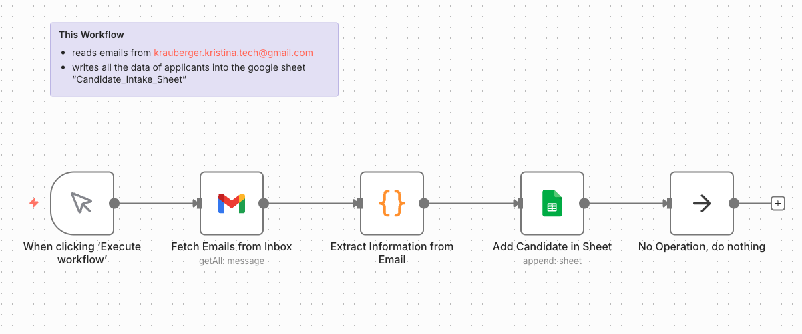
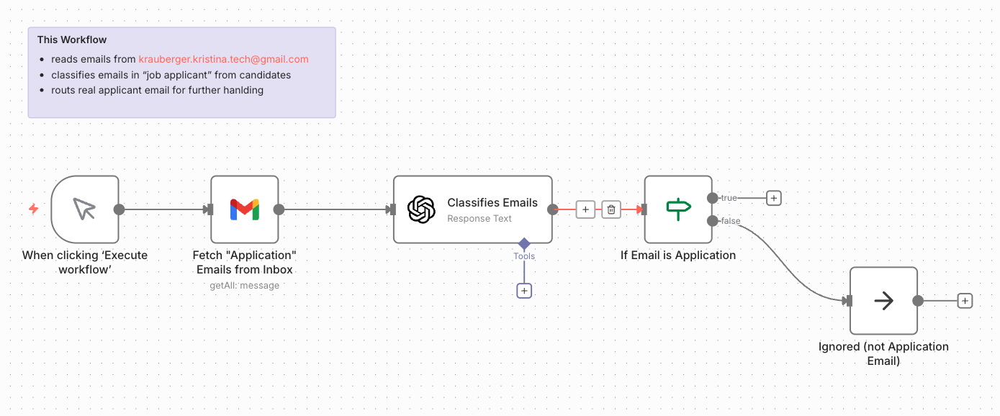
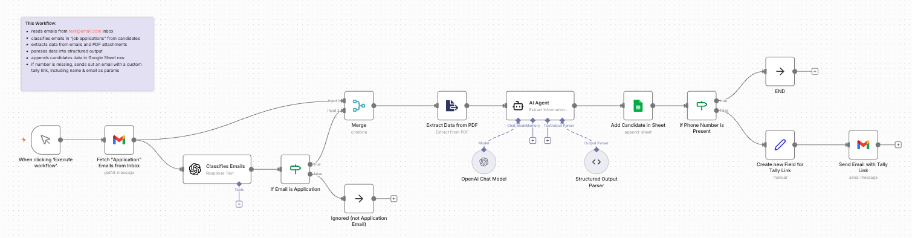
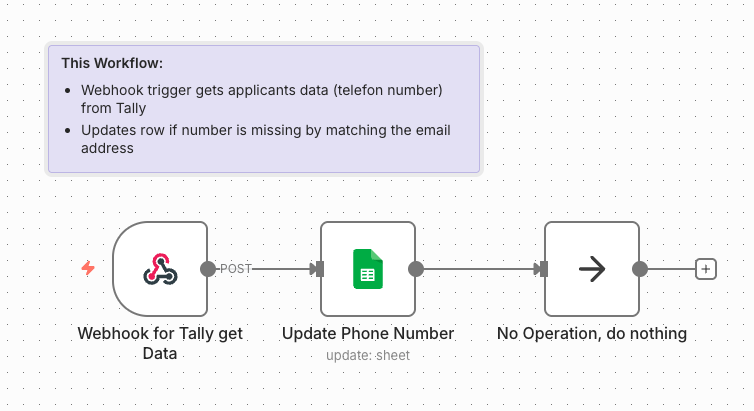
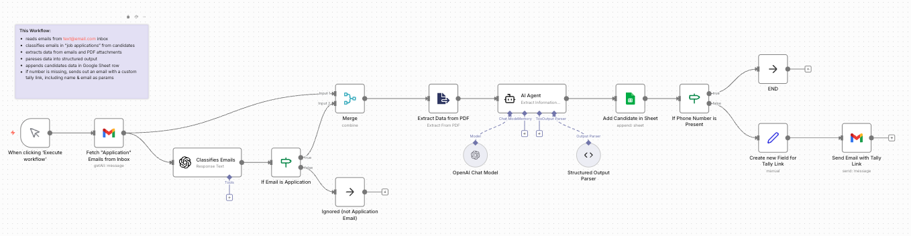
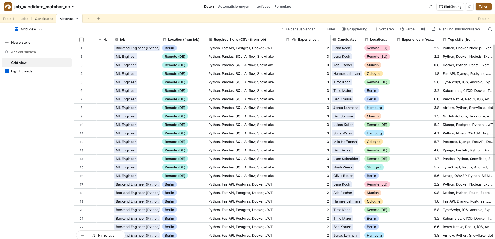

# AI Workflow Automation – Candidate Job Matching

Case study of modular n8n workflows for candidate intake, job intake, AI-assisted data cleaning, and candidate-job matching using Gmail, Tally, Webhooks, Google Sheets, Airtable, and OpenAI.

---

# Overview

This project explores how AI-assisted workflow automation can streamline candidate and job intake processes using modular n8n workflows.

The system was built as part of a Masterschool automation project and focuses on automating repetitive intake, classification, parsing, routing, and matching tasks across multiple workflow steps.

The workflows combine:
- email intake
- AI-assisted classification
- PDF parsing
- structured output generation
- webhook communication
- automated spreadsheet updates
- routing logic

The project emphasizes:
- modular workflow architecture
- automation logic
- AI-assisted processing
- human-in-the-loop workflow design
- scalable process thinking

---

# Technologies Used

## Automation & Orchestration
- n8n
- Webhooks

## AI & Data Processing
- OpenAI
- LLM Integration
- AI-assisted Classification
- Structured Output Parsing

## Data & Intake Tools
- Google Sheets
- Airtable
- Tally Forms

## Communication & Input Sources
- Gmail
- Email Automation

## Supporting Logic
- Python
- Conditional Routing
- Data Cleaning
  
---

# Workflow Architecture

The project consists of several modular workflows working together as a larger automation system.

## 1. Candidate Intake Workflow

Reads incoming application emails and stores structured candidate information.

### Features
- Fetches emails from Gmail inbox
- Extracts applicant information
- Writes candidate data into Google Sheets
- Handles structured intake logic



---

## 2. AI Email Classification Workflow

Uses AI classification logic to identify whether incoming emails are valid applications.

### Features
- AI-assisted email classification
- Routing logic for application vs. non-application emails
- Workflow branching



---

## 3. Information Extraction & Matching Workflow

Main orchestration workflow for extracting, cleaning, parsing, and matching candidate information.

### Features
- PDF extraction
- AI-assisted structured parsing
- Candidate/job matching logic
- Automated routing
- Conditional workflow execution
- Tally link generation for missing data



---

## 4. Webhook + Tally Integration

Handles missing phone number collection through webhook automation.

### Features
- Webhook triggers
- Tally form integration
- Automatic Google Sheets updates
- Matching records by email address



---

## 5. Job Intake Workflow

Processes incoming job postings and standardizes data before storing it.

### Features
- Job intake automation
- AI-assisted data cleaning
- Structured output formatting
- Automated lead confirmation emails



---

# System Flow

```text
Candidate Email Intake
        ↓
AI Classification
        ↓
PDF/Data Extraction
        ↓
Structured Output Parsing
        ↓
Google Sheets / Airtable Storage
        ↓
Candidate ↔ Job Matching
        ↓
Missing Data Handling via Tally + Webhooks
```

---

## Data Layer & Matching Logic

Airtable was used as a lightweight relational database layer to organize:
- candidate profiles
- incoming job postings
- skill matching
- location matching
- experience comparisons
- candidate-job relationships

The structure enabled easier filtering, matching visualization, and scalable workflow organization.

 


Optional: View Airtable Structure (Read-Only)

[Open Airtable Base](https://airtable.com/invite/l?inviteId=invFhZ0Z3XibdTRgR&inviteToken=59283ced6816eb0b00a52d43fc4920183062c47c612ffd363bc4c8813f0c8aab&utm_medium=email&utm_source=product_team&utm_content=transactional-alerts)

---

# Key Learnings

This project helped deepen my understanding of:

- modular workflow design
- AI-assisted automation systems
- webhook orchestration
- structured output parsing
- multi-step workflow logic
- human-in-the-loop automation
- routing and branching logic
- integrating LLMs into real workflow systems
- connecting business processes with technical automation

---

# Challenges

Some workflows required handling:
- incomplete applicant data
- PDF parsing limitations
- workflow branching complexity
- structured AI outputs
- multi-step orchestration across separate workflows

The project was intentionally built in modular parts to better understand workflow orchestration and scalable automation design.

---

# Future Improvements

Potential future improvements include:
- improved matching logic
- Airtable-based relational storage
- dashboard visualization
- better scoring systems
- deployment of a unified end-to-end workflow
- automated candidate ranking
- improved error handling and monitoring

---

# About

This project was created as part of the Masterschool Software Engineering & Automation program and focuses on real-world AI-assisted workflow automation concepts using modular n8n architecture.
